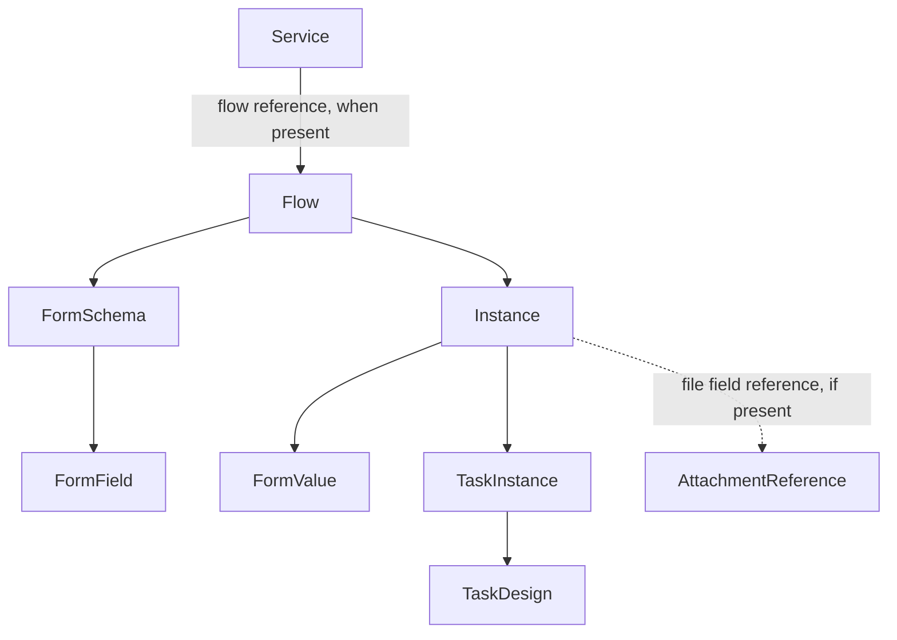

# BE-004B: Zeev source discovery

## Issues to Address

TON needs a complete, value-safe view of the Zeev source before operational synchronization. The five startable flows alone do not describe the accessible source.

## Important Notes

- The tenant Swagger contract is at `https://nucleo.zeev.it/api/2/docs`.
- On 2026-09-23, the account could start five flows and edit 35 flows. The five startable IDs are in the editable set.
- Form and task design are readable for all 35 flow IDs. They contain 916 fields and 401 design elements.
- The account has write rights. Every transport call must pass the BE-004A read-only allowlist.
- Form values, people data, tokens, and file references stay in memory for the bounded probe. They are absent from catalog models and documents.

## Implementation strategy

`ZeevCatalogService` uses `ZeevClient`. It has no HTTP transport of its own. It joins startable and editable flows by the tenant numeric `flowId`/`id`, then reads each form and task design in sequence. The catalog contains typed flows, services, fields, design elements, capabilities, warnings, source candidates, and value-free shape profiles.

The canonical flow identity is the tenant-scoped numeric flow ID. The source also exposes `uid`/`flowUid` and `version`/`flowVersion`. Store them as secondary and version metadata. A flow name is display text. Neither name nor version is an identity key. The API does not prove whether a UID remains the same across imports or copies.

Flow entries retain returned active and deploy flags, descriptions, category, parent ID, execution mode, startable team IDs, and last deploy time. Service entries retain their own ID, UID, name, flow reference, description, deploy flag, and last deploy time. User-specific links and raw response objects stay out of the catalog.

A form or task design error sets a state on its flow and adds a warning. Other flows continue. Repeated HTTP 429 responses stop expansion and leave later flows marked unavailable. A 429 during structural sampling returns the catalog with a warning. Authentication and global inventory failures fail discovery. Output order uses folded flow name and numeric ID. Fields use Zeev design order, then field ID.

The catalog reads source-level field and design-element metadata. It keeps Zeev's original types. A small source field kind helps compare structures. It does not map fields to TON business entities. Table/repeating semantics are set only when Zeev reports a table type. No table type appeared in this tenant's 35 form designs. A design element stores task ID, title, type, order, page, timing flags, and counts. It does not keep users or message content.

The live `design/elements` route returns a top-level array. Swagger instead declares an object with a `tasks` array. The adapter follows the validated tenant response. It records each element's `users` representation as null, array, or string, but discards the contents.

The structural sample uses a one-day range, one page, five records, and at most three selected file fields in one detail request. It profiles keys, types, null counts, and array lengths. It discards scalar values. One requester ID, team ID, and position ID from that sample supports three single-record read probes. No user or team list is imported.

Candidate areas use flow names, section names, and field labels. They are human-review hints. A flow can have several candidate areas. A label can produce a false positive. No candidate becomes a production domain mapping.

The public Swagger has two `/api/2/files` paths. Both are POST write operations. The read instance schema documents `formFields[].openUrl`, and live forms contain file fields. BE-004B classifies attachment read as `REFERENCE_ONLY`. It does not request open file URLs or download content.

The service/application relationship follows the public contract: `requests/flows` lists startable applications, `flows/edit` lists editable applications, and a service result can refer to a flow. This tenant returned zero startable services. An instance refers to a flow and can refer to a service. An instance contains form values and task instances. A form design belongs to a flow. This is a source relationship model, not a TON domain model.

## Tests

Transport tests cover the read-only firewall, bounded requests, retries, and token safety. Catalog tests cover the flow union, stable IDs, ordering, fields, unknown types, table handling, partial failures, candidate inputs, shape profiling, identity probes, rate-limit stop, and safe CLI text. Live discovery checks source access without mutation. Ruff, formatting, ty, relevant pytest, and `git diff --check` are the quality gates.

## Live results and network audit

See [the human-review catalog](zeev-source-catalog.md) for the full inventory and capability matrix. The live CLI read 35 flows, 35 form schemas, 916 fields, 35 task designs, and 401 design elements. It sampled five instances and 14 embedded tasks. It returned no warning. It saw no 429 response and sent zero mutation calls.

The CLI reports only method, path template, and count. It does not print query values or response bodies. The run made one token request, one request each for startable flows, editable flows, and services, 35 form requests, 35 task-design requests, one bounded instance report, one selected instance detail, one pending assignment request, and one single-record request each for a user, team, and role.

## Boundary to BE-004C

BE-004C must decide which flow IDs and resources to synchronize. Numeric flow, instance, task instance, user, team, and position IDs appear stable within this tenant, but cross-import stability needs confirmation. `startDateTime`, `endDateTime`, and `lastFinishedTaskDateTime` appear in the instance schema. The public report accepts bounded date filters for these fields. The API contract does not prove that these fields cover all updates to active instances or form values. Incremental synchronization therefore needs a separate validation plan and a backfill decision.

BE-004B adds no database table, SourceSnapshot, checkpoint, raw payload store, domain mapping, specialist tool, or file ingestion. Luyla's files need their own source analysis after this Zeev catalog.
